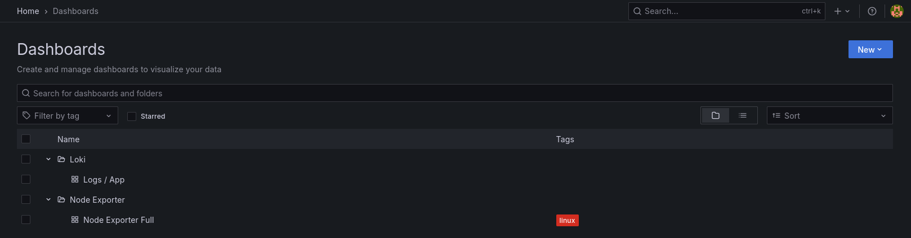
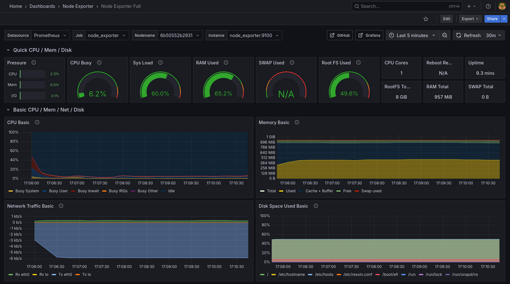
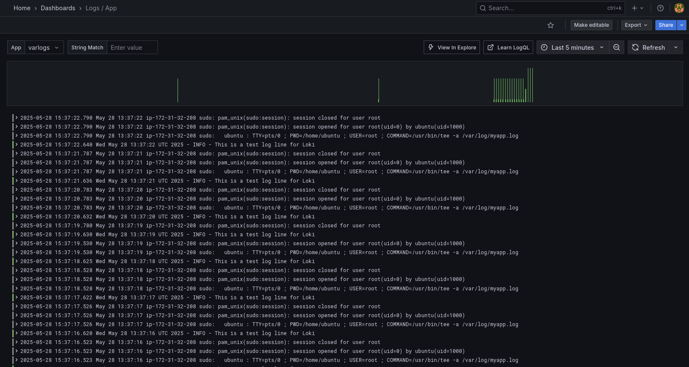

# DevOps Monitoring Infrastructure — AWS + Terraform + Ansible + Docker

Projet personnel complet d'automatisation d'infrastructure cloud avec déploiement d'une stack de monitoring à l'aide de Terraform, Ansible, Docker Compose, Prometheus, Loki, Promtail, et Grafana.

## ⚙️  Stack Technique

- **Terraform** : Provisionnement automatique d'une instance EC2 sur AWS
- **Ansible** : Configuration complète de l’instance (Docker, monitoring stack, permissions, etc.)
- **Docker Compose** : Déploiement de la stack de monitoring
- **Prometheus** : Collecte des métriques système (via node_exporter)
- **Loki + Promtail** : Centralisation des logs système 
- **Grafana** : Visualisation des logs et métriques (dashboards préconfigurés)
- **GitHub Actions** : CI/CD pour tout automatiser (infra + provisioning)

## 🚀 Déploiement en un clic

Toute la chaîne de déploiement est automatisée avec GitHub Actions.

Pour un déploiement manuel :

```bash
cd terraform-aws
terraform init
terraform apply -auto-approve

./generate_inventory.sh

cd ../ansible
ansible-playbook -i inventory setup-docker.yml
```
## 🔐 Configuration des secrets

Le projet utilise des secrets GitHub pour sécuriser les informations sensibles.

### Secrets à définir

| Nom du secret | Description |
| --- | --- |
| `AWS_ACCESS_KEY_ID` | Clé d'accès AWS pour Terraform |
| `AWS_SECRET_ACCESS_KEY` | Clé secrète AWS pour Terraform |
| `SSH_PRIVATE_KEY` | Clé privée SSH pour se connecter à EC2 |
| `SSH_PUBLIC_KEY` | Clé publique associée pour Terraform |

### Génération des clés SSH

```bash
ssh-keygen -t rsa -b 4096 -f id_rsa
```
Ajoutez dans les secrets GitHub :
- `SSH_PRIVATE_KEY` = contenu de id_rsa
- `SSH_PUBLIC_KEY` = contenu de id_rsa.pub

## 📊 Dashboard Grafana

L’instance Grafana est préconfigurée avec :
- Un dashboard Node Exporter (CPU, RAM, I/O, etc.)
- Un dashboard Loki (requêtes de logs centralisées)





# ✅ Fonctionnalités complètes
- Provisionnement complet et automatique
- Monitoring système avec Prometheus et Node Exporter
- Centralisation de logs avec Loki + Promtail
- Visualisation avancée dans Grafana (métriques + logs)
- CI/CD via GitHub Actions
